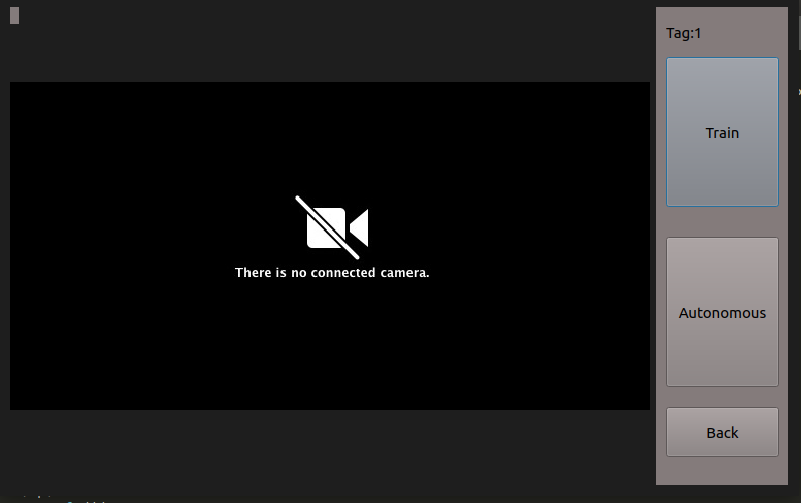

# Open Pit Mine Autonomous Bot

The project was focused on developing an unmanned ground vehicle for working in the environment of open - pit mines.The proposed vehicle would be easily able to maneuver along the path of the pit autonomously, transporting ores or disposing waste rocks to the dumping ground. Due to robust localization technique the vehicle could operate in remote areas without any external help.

Software Requirements

1. Python 3.0.x
2. Ubuntu 16 or above
3. Raspbian OS
4. Arduino IDE 1.6.x

Hardware Requirements

1. Arduino Uno Mega 2560
2. Raspberry Pi 3
3. Jumper wires
4. L293D motor driver
5. IR sensors LM393 (2)
6. IMU sensor - MPU6050
7. Ultrasonic sensors (2) HC-SR04
8. Servo motor SG90
9. 12v DC motor
10. RC bot chassis
11. Camera - (Logitech C270 HD Webcam)
12. Rechargeable 12v LiPo battery
13. PI camera (Model B Camera Module)

Demo

UI

